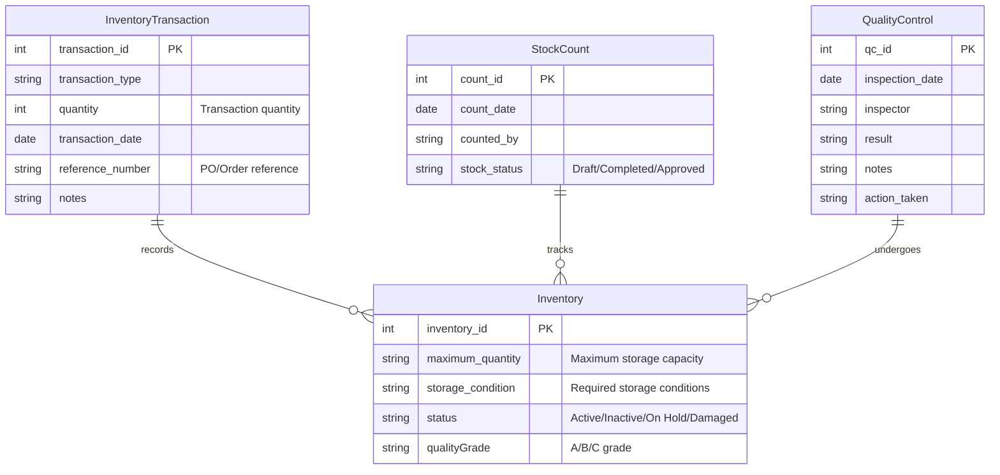

```mermaid
erDiagram
    InventoryTransaction ||--o{ Inventory : records
    StockCount ||--o{ Inventory : tracks
    QualityControl ||--o{ Inventory : undergoes

    Inventory {
        int inventory_id PK
        string maximum_quantity "Maximum storage capacity"
        string storage_condition "Required storage conditions"
        string status "Active/Inactive/On Hold/Damaged"
        string qualityGrade "A/B/C grade"
    }

    InventoryTransaction {
        int transaction_id PK
        string transaction_type
        int quantity "Transaction quantity"
        date transaction_date
        string reference_number "PO/Order reference"
        string notes
    }

    StockCount {
        int count_id PK
        date count_date
        string counted_by
        string stock_status "Draft/Completed/Approved"
    }

    QualityControl {
        int qc_id PK
        date inspection_date
        string inspector
        string result
        string notes
        string action_taken
    }
```